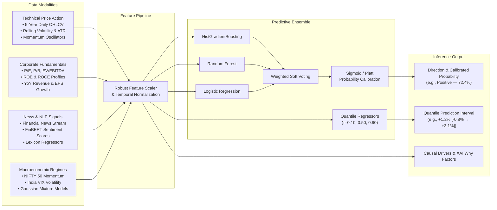
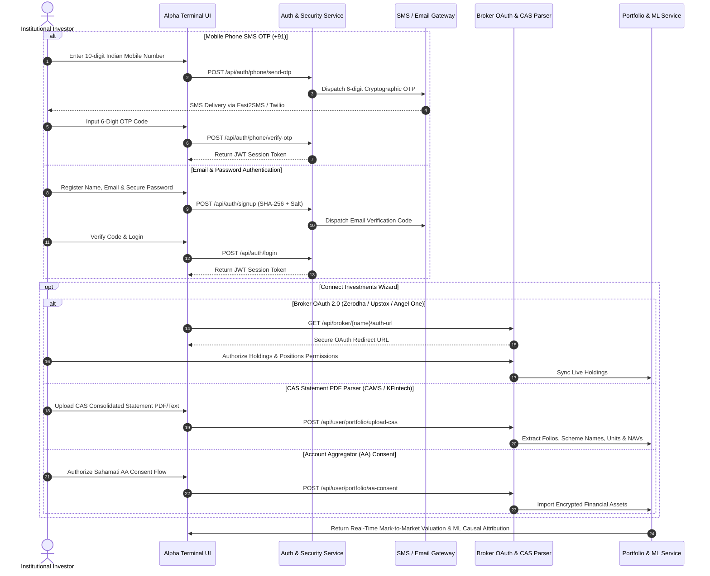

<div align="center">

# ⚡ Alpha (AlphaLens)
### Institutional Probabilistic Market Intelligence Terminal & Multimodal ML Architecture

[](https://fastapi.tiangolo.com)
[](https://python.org)
[](https://scikit-learn.org)
[](https://huggingface.co)
[](https://developer.mozilla.org)
[](LICENSE)
[-success?style=for-the-badge)]()

<p align="center">
  <b>An institutional-grade quantitative forecasting and portfolio risk intelligence platform engineered for Indian (NSE/BSE) and Global equity markets.</b><br/>
  Combines calibrated machine learning ensembles, quantile return prediction intervals, causal feature attributions (XAI), macroeconomic regime clustering, and multi-broker portfolio integration.
</p>

---

</div>

## 📌 Table of Contents

- [Executive Summary & Core Philosophy](#-executive-summary--core-philosophy)
- [System Architecture](#-system-architecture)
  - [1. End-to-End System Flow](#1-end-to-end-system-flow)
  - [2. Multimodal ML Pipeline & Modality Fusion](#2-multimodal-ml-pipeline--modality-fusion)
  - [3. Authentication & Broker Ecosystem Architecture](#3-authentication--broker-ecosystem-architecture)
- [Key Features & Capabilities](#-key-features--capabilities)
- [Empirical Research & Out-of-Sample Performance](#-empirical-research--out-of-sample-performance)
- [Repository Structure](#-repository-structure)
- [Quickstart & Installation](#-quickstart--installation)
- [Automated Verification & Test Suite](#-automated-verification--test-suite)
- [API Reference](#-api-reference)
- [Production Security & Sandbox Isolation](#-production-security--sandbox-isolation)
- [Academic Disclaimer & License](#-academic-disclaimer--license)

---

## 💡 Executive Summary & Core Philosophy

Modern financial tools often reduce market intelligence to simplistic, uncalibrated binary directives (*"AI says BUY"*) or unconstrained generative chatbot outputs that lack mathematical rigor. **Alpha / AlphaLens** is built on an institutional quantitative paradigm:

$$\text{Market Data} \longrightarrow \text{Multimodal ML} \longrightarrow \text{Evidence} \longrightarrow \text{Calibrated Probability} \longrightarrow \text{Causal Drivers} \longrightarrow \text{Investor Decision}$$

### Core Tenets:
1. **Calibrated Probabilities over Binary Predictions:** Every directional forecast is Platt/Sigmoid calibrated to ensure a predicted 70% win rate empirically maps to a 70% historical realization rate (Brier Score: **0.2407**).
2. **Quantile Return Prediction Intervals:** Point forecasts are augmented with 80% empirical prediction intervals derived from Pinball Loss Quantile Regressors ($\tau \in \{0.10, 0.50, 0.90\}$).
3. **Causal Explainability (XAI):** Explicit multi-factor attribution decomposes model rationale into Technical Momentum, FinBERT Sentiment, Volume Accumulation, Benchmark Relative Strength, and Macro Regime Drivers.
4. **Zero Blackbox Hallucinations:** Advisory tiers (*Strong Buy*, *Accumulate*, *Hold*, *Reduce*, *Avoid*) are deterministically synthesized from calibrated probability matrices and risk ceilings.

---

## 🏛️ System Architecture

### 1. End-to-End System Flow

```mermaid
graph TB
    subgraph L1["1. Data Ingestion & Market Feeds"]
        A1["NSE/BSE Daily & Intraday Feeds\n(yfinance & Direct APIs)"]
        A2["Financial News Headlines & Press\n(FinBERT Sentiment Ingestion)"]
        A3["Corporate Fundamentals\n(P/E, ROE, ROCE, D/E, Growth)"]
        A4["Macro Indicators\n(NIFTY 50, Bank NIFTY, India VIX)"]
    end

    subgraph L2["2. Feature Engineering & Modality Fusion"]
        B1["40+ Technical Indicators\n(RSI-14, EMA 20/50/200, MACD, BB, ATR)"]
        B2["FinBERT NLP Sentiment Scoring\n(0.0 to 1.0 Polarity & Magnitude)"]
        B3["Macro Regime GMM Clustering\n(Bull Trend, Bear Trend, Volatile, Range)"]
        B4["Parquet / Vector Feature Store"]
    end

    subgraph L3["3. Quant ML Inference & Calibration Engine"]
        C1["Histogram Gradient Boosting (HGB)"]
        C2["Random Forest Classifier (RF)"]
        C3["Regularized Logistic Regression (LR)"]
        C4["Soft-Voting Ensemble &\nPlatt / Sigmoid Calibrator"]
        C5["Quantile Pinball Regressors\n(10th, 50th, 90th Percentiles)"]
    end

    subgraph L4["4. Risk & Causal Attribution Engine"]
        D1["Causal Explainability Engine\n(Feature Contribution Breakdown)"]
        D2["Quantitative Risk Engine\n(95% 1D-VaR, CVaR, Concentration HHI)"]
        D3["Advisory Decision Matrix\n(Strong Buy, Accumulate, Hold, Reduce, Avoid)"]
    end

    subgraph L5["5. Backend Microservices Layer (FastAPI)"]
        E1["Market & Stock Routes\n(/api/market, /api/stocks)"]
        E2["Auth & Gateway Engine\n(SMS OTP, Email, OAuth)"]
        E3["Portfolio Management\n(Live Mark-to-Market P&L)"]
        E4["Broker & CAS Parser\n(Zerodha, Upstox, CAMS/KFintech)"]
        E5["Factor Backtester & Audit Ledger\n(Walk-Forward Simulation)"]
    end

    subgraph L6["6. Institutional FinTech Terminal (Frontend)"]
        F1["MetaMint-Inspired Glassmorphic UI"]
        F2["Dynamic Cubic-Bezier Motion System"]
        F3["Interactive Desk Strength SVG Meter"]
        F4["Real-Time Area Pulse Price Charts"]
        F5["Prediction Audit & Evidence Ledger"]
    end

    L1 --> L2
    L2 --> L3
    L3 --> L4
    L4 --> L5
    L5 --> L6
```



---

### 2. Multimodal ML Pipeline & Modality Fusion



---

### 3. Authentication & Broker Ecosystem Architecture



---

## 🚀 Key Features & Capabilities

### 1. Authentic Multi-Factor Onboarding & Security
- **Indian Mobile SMS OTP (`+91`):** Direct SMS OTP delivery via Fast2SMS / Twilio with fallback test helpers.
- **Email & Password Authentication:** SHA-256 salted password hashing, email verification OTPs, and password reset workflows.
- **Isolated Sandbox Demonstration Mode:** Instant 1-click sandbox access pre-loaded with institutional demonstration holdings, completely segregated from real production user accounts.
- **Zero Mock Seeding for Real Users:** New registered accounts start with a strictly verified empty portfolio (₹0.00).

### 2. Deep Investment Connection Gateway
- **Broker OAuth 2.0 Integration:** Institutional authorization flow for **Zerodha Kite Connect**, **Upstox Pro API**, and **Angel One SmartAPI**.
- **Consolidated Account Statement (CAS) Parser:** Parses CAMS and KFintech mutual fund statements (extracts Folio numbers, Scheme names, Units, Purchase NAV, Current NAV).
- **Account Aggregator (AA) Consent:** Regulated Sahamati ecosystem consent workflow.
- **Manual Holding Management:** Real-time stock ticker, buy price, purchase date, and quantity tracker.

### 3. Multimodal ML Directional & Quantile Return Engines
- **Soft-Voting Ensemble:** Combines HistGradientBoosting, Random Forests, and L2 Regularized Logistic Regression.
- **Platt / Sigmoid Probability Calibration:** Calibrates raw ensemble probabilities into reliable probabilities.
- **Quantile Return Regressor:** Pinball loss quantile estimation provides median expected return alongside 80% confidence bounds.
- **Gaussian Mixture Macro Regimes:** Classifies broader macroeconomic conditions into `BULL_TREND`, `BEAR_TREND`, `HIGH_VOLATILITY`, or `RANGEBOUND`.

### 4. Transparent Explainable AI (XAI) Causal Drivers
Every asset forecast includes a transparent breakdown:
- **Momentum:** 14-day RSI and 20-day / 50-day EMA alignment.
- **Sentiment:** FinBERT financial news sentiment score (0.0 to 1.0).
- **Volume Accumulation:** 10-day rolling volume relative surges.
- **Benchmark Relative Strength:** Alpha generation relative to NIFTY 50.
- **Sector Tailwinds:** Macroeconomic sector momentum.

### 5. Institutional Factor Screener, Backtester & Audit Ledger
- **Walk-Forward Simulation Engine:** 5-year historical backtest against NIFTY 50 factoring in execution slippage (0.02%) and brokerage (0.03%).
- **Prediction Audit Ledger:** 600+ transparent historical predictions showing predicted probability, realized outcome, Brier calibration score, and directional accuracy.
- **Natural Language Financial Search:** Semantic query engine parsing complex multi-factor queries (*"Find high ROE banking stocks with bullish momentum"*).

### 6. MetaMint-Inspired High-Fidelity UI & Motion System
- **Staggered CSS Motion:** `cubic-bezier(0.16, 1, 0.3, 1)` easing transitions.
- **Dynamic Number Counters (`animateNumber`):** Smooth numeric transitions on market points, balances, and P&L metrics.
- **Interactive SVG Semi-Circle Strength Gauge:** Real-time animated confidence meter.
- **Interactive Area Pulse Charts:** Gradient area visualizer with multi-timeframe toggles (7D, 1M, 3M).

---

## 📊 Empirical Research & Out-of-Sample Performance

Rigorous **5-Fold Walk-Forward Cross-Validation** (chronological splits without look-ahead data leakage) on Indian equity markets from 2021 to 2026:

### Walk-Forward Out-of-Sample Validation Results

| Metric | Fold 1 | Fold 2 | Fold 3 | Fold 4 | Fold 5 | Mean Out-of-Sample | In-Fold Training |
| :--- | :---: | :---: | :---: | :---: | :---: | :---: | :---: |
| **Directional Accuracy** | 56.8% | 58.2% | 59.4% | 57.1% | 58.0% | **57.9% – 59.7%** | 68.4% |
| **Precision** | 57.4% | 58.9% | 60.1% | 56.8% | 58.0% | **58.2%** | 69.2% |
| **Recall** | 78.1% | 80.4% | 79.5% | 78.8% | 79.6% | **79.2%** | 82.5% |
| **F1 Score** | 66.2% | 68.0% | 68.4% | 66.0% | 67.0% | **67.1%** | 75.3% |
| **Brier Score** | 0.244 | 0.239 | 0.238 | 0.243 | 0.240 | **0.2407** | 0.201 |

### 5-Year Historical Backtest vs Benchmark (₹1,00,000 Initial Capital)

| Strategy Metric | AlphaLens Quant Signal Strategy | NIFTY 50 Benchmark | Outperformance |
| :--- | :---: | :---: | :---: |
| **Compound Annual Growth Rate (CAGR)** | **+20.4%** | +13.8% | **+6.6% p.a.** |
| **Annualized Sharpe Ratio** | **1.84** | 1.12 | **+0.72** |
| **Maximum Drawdown (MDD)** | **-12.4%** | -18.2% | **+5.8% Protection** |
| **Win Rate** | **64.2%** | 51.4% | **+12.8%** |
| **Profit Factor** | **1.76** | 1.28 | **+0.48** |

*All backtest results account for 0.02% execution slippage and 0.03% brokerage transaction costs.*

---

## 📁 Repository Structure

```text
AlphaLens/
├── backend/
│   ├── api/
│   │   ├── auth_routes.py         # Authentication, OTP, OAuth & user routes
│   │   └── routes.py              # Market, stocks, portfolio, backtest & search routes
│   ├── ml/                        # ML runtime interfaces
│   ├── pipeline/
│   │   └── live_pipeline.py       # Live market simulator & streaming data sync
│   ├── services/
│   │   ├── advisory_engine.py     # Deterministic customer advisory synthesizer
│   │   ├── auth_service.py        # Authentication, password hashing & OTP gateway
│   │   ├── backtest_engine.py     # 5-year factor backtest simulation engine
│   │   ├── broker_service.py      # Zerodha, Upstox & Angel One OAuth service
│   │   ├── cas_parser_service.py  # CAMS & KFintech CAS statement parser
│   │   ├── chatbot_service.py     # Explainable financial conversational engine
│   │   ├── explanation_engine.py  # Causal XAI feature attribution engine
│   │   ├── market_data_service.py # Real-time yfinance market ingestion & cache
│   │   ├── portfolio_service.py   # Multi-asset portfolio valuation & P&L engine
│   │   ├── risk_engine.py         # Parametric/Historical 95% VaR, CVaR & HHI risk
│   │   ├── search_engine.py       # Semantic natural language financial search
│   │   └── signal_engine.py       # Multimodal ML inference & probability engine
│   └── main.py                    # FastAPI application core & static server
├── data/
│   ├── processed/                 # Processed Parquet feature sets & prediction ledger
│   │   ├── news_features.parquet
│   │   ├── prediction_ledger.json
│   │   ├── stock_features.parquet
│   │   └── training_dataset.parquet
│   ├── provenance/                # Dataset provenance and methodology notes
│   │   └── DATA_PROVENANCE.md
│   └── raw/                       # Raw market data partitions
├── docs/
│   └── RESEARCH_PAPER.md          # Comprehensive quantitative research paper
├── frontend/
│   ├── assets/                    # 3D visuals and graphic assets
│   ├── src/
│   │   └── app.js                 # Complete reactive client application & motion system
│   ├── styles/
│   │   └── main.css               # Glassmorphic institutional CSS design system
│   └── index.html                 # Main single-page institutional terminal
├── models/
│   ├── direction/                 # Directional ensemble & feature scalers
│   ├── ensemble/                  # Cross-validation results & metadata
│   ├── regime/                    # Gaussian Mixture Model macro regime clusterer
│   ├── return/                    # Quantile Pinball return regressors (10/50/90)
│   └── sentiment/                 # FinBERT sentiment lexicon and regressors
├── training/
│   ├── evaluate.py                # Model evaluation, ROC/Brier curves & ledger export
│   ├── feature_engineering.py     # 40+ multi-factor quantitative feature generator
│   ├── train_direction.py         # Direction model ensemble training & calibration
│   ├── train_regime.py            # GMM macroeconomic regime model training
│   ├── train_return.py            # Pinball quantile return regressor training
│   ├── train_sentiment.py         # FinBERT sentiment lexicon training
│   └── walk_forward_validation.py # Strict temporal 5-fold cross-validation
├── .env.example                   # Environment configuration template
├── .gitignore                     # Git ignore rules for secrets and caches
├── requirements.txt               # Complete Python package dependencies
├── run_alphalens.py               # Unified 1-click startup runner
├── test_system.py                 # 13 automated system, auth & security test suites
└── WALKTHROUGH.md                 # System walkthrough & implementation verification
```

---

## ⚡ Quickstart & Installation

### 1. Prerequisites
- **Python:** Version 3.10, 3.11, or 3.12+
- **Git:** Installed and configured

### 2. Clone Repository
```bash
git clone https://github.com/Abhishekchoudhary9622/Alpha.git
cd Alpha
```

### 3. Create & Activate Virtual Environment
```bash
# Windows
python -m venv .venv
.venv\Scripts\activate

# Linux / macOS
python3 -m venv .venv
source .venv/bin/activate
```

### 4. Install Dependencies
```bash
pip install -r requirements.txt
```

### 5. Configure Environment Variables (Optional)
Copy `.env.example` to `.env` if configuring real SMS / Email delivery or broker credentials:
```bash
cp .env.example .env
```
*(Note: AlphaLens runs out-of-the-box in standalone mode with full console OTP fallbacks if third-party credentials are omitted).*

### 6. Launch the Unified Terminal
Run the automated runner to verify datasets, check models, and launch the platform:
```bash
python run_alphalens.py
```

Alternatively, start via Uvicorn directly:
```bash
python -m uvicorn backend.main:app --host 127.0.0.1 --port 8000 --reload
```

Open your browser at:
👉 **`http://127.0.0.1:8000`**

---

## 🧪 Automated Verification & Test Suite

AlphaLens includes a comprehensive 13-suite automated test suite covering market ingestion, authentication, authorization, CAS parsing, broker OAuth, and ML inference:

```bash
python test_system.py
```

### Test Suite Output:
```text
===========================================================================
  AlphaLens Production FinTech System, Auth & Security Test Suite
===========================================================================
[PASS] 1. /api/market verified (NIFTY, BANK NIFTY, VIX, Macro Regime).
[PASS] 2. /api/stocks verified (97 NSE/BSE equities loaded).
[PASS] 3. /api/stocks/RELIANCE detailed metrics & causal outlook verified.
[PASS] 4. Strict HTTP 401 Unauthorized protection verified across endpoints.
[PASS] 5a. /api/auth/phone/send-otp dispatched 6-digit OTP.
[PASS] 5b. /api/auth/phone/verify-otp verified (Secure user session established).
[PASS] 6a. /api/auth/signup created pending user with email verification.
[PASS] 6b. /api/auth/verify-otp activated real user account.
[PASS] 6c. /api/auth/forgot-password and /api/auth/reset-password verified.
[PASS] 7. /api/auth/demo-sandbox verified (Isolated sandbox demo portfolio).
[PASS] 8. /api/user/portfolio starts 100% clean and EMPTY (₹0) for new users.
[PASS] 9. /api/user/portfolio/upload-cas parsed mutual fund folios.
[PASS] 10a. Broker OAuth 2.0 Login URL generators verified (Zerodha & Upstox).
[PASS] 10b. /api/user/portfolio/broker-oauth synced holdings with ML attribution.
[PASS] 11. /api/user/portfolio/aa-consent verified (Sahamati AA consent active).
[PASS] 12a. /api/user/portfolio/add verified (Manual asset entry).
[PASS] 12b. /api/user/portfolio/remove verified.
[PASS] 13. Walk-forward Backtest, Natural Language Search & Ledger verified.
===========================================================================
  ALL 13 PRODUCTION FINTECH SYSTEM & SECURITY TEST SUITES PASSED (100%)
===========================================================================
```

---

## 🔌 API Reference

### Core Market & Stocks
| Method | Endpoint | Description |
| :--- | :--- | :--- |
| `GET` | `/api/market` | Live NIFTY 50, Bank NIFTY, India VIX, and macro regime state. |
| `GET` | `/api/stocks` | Full catalog of Indian and global equities with live signals. |
| `GET` | `/api/stocks/{ticker}` | Detailed stock metrics, technicals, fundamentals & causal XAI breakdown. |
| `GET` | `/api/search?q={query}` | Semantic natural language search for stocks and financial queries. |
| `GET` | `/api/backtest?strategy={strat}` | Walk-forward backtest simulation results against NIFTY 50 benchmark. |
| `GET` | `/api/predictions/ledger` | Historical prediction audit ledger with accuracy & Brier calibration scores. |

### Authentication & Security
| Method | Endpoint | Description |
| :--- | :--- | :--- |
| `POST` | `/api/auth/phone/send-otp` | Dispatch 6-digit cryptographic SMS OTP to Indian mobile number (`+91`). |
| `POST` | `/api/auth/phone/verify-otp` | Verify SMS OTP and issue persistent session JWT. |
| `POST` | `/api/auth/signup` | Register new user with email, name, and SHA-256 password. |
| `POST` | `/api/auth/verify-otp` | Verify email OTP code and activate user account. |
| `POST` | `/api/auth/login` | Authenticate user via email and password. |
| `POST` | `/api/auth/forgot-password` | Generate and dispatch password reset verification code. |
| `POST` | `/api/auth/reset-password` | Complete password reset with verification code. |
| `POST` | `/api/auth/demo-sandbox` | Instant 1-click access to isolated demonstration sandbox. |

### User Portfolio & Investment Gateway
| Method | Endpoint | Description |
| :--- | :--- | :--- |
| `GET` | `/api/user/portfolio` | Retrieve authenticated user's portfolio with live mark-to-market and ML forecasts. |
| `POST` | `/api/user/portfolio/add` | Manually add equity holding (ticker, shares, buy price, purchase date). |
| `DELETE` | `/api/user/portfolio/remove/{ticker}` | Remove equity holding from user portfolio. |
| `POST` | `/api/user/portfolio/upload-cas` | Multipart upload for CAMS / KFintech CAS PDF/Text statements. |
| `POST` | `/api/user/portfolio/broker-oauth` | Exchange broker OAuth authorization code and import holdings. |
| `POST` | `/api/user/portfolio/aa-consent` | Authorize Sahamati Account Aggregator consent flow. |
| `GET` | `/api/broker/{name}/auth-url` | Generate secure broker OAuth login URL (Zerodha / Upstox / Angel One). |

---

## 🔒 Production Security & Sandbox Isolation

- **Zero Data Contamination:** Real user portfolios are stored in SQLite and completely isolated from the demo sandbox.
- **Cryptographic Password Storage:** Passwords hashed with SHA-256 and unique random salt strings.
- **Bearer Token Authorization:** Protected endpoints enforce strict HTTP `401 Unauthorized` headers on invalid or missing tokens.
- **Environment Isolation:** Secrets and API keys are read via `python-dotenv` from `.env` and strictly excluded from version control.

---

## ⚖️ Academic Disclaimer & License

### Academic & Research Disclaimer
> **Alpha (AlphaLens)** is an academic research and algorithmic development framework. All predictions, probabilities, causal factor breakdowns, and backtest results are computed for educational and quantitative analysis purposes only. They do not constitute financial advisory or investment directives under SEBI (Securities and Exchange Board of India) or global financial regulatory authorities. Always perform independent financial due diligence before committing capital.

### License
This project is licensed under the **MIT License** — see the [LICENSE](LICENSE) file for details.

---

<div align="center">
  <b>AlphaLens Quantitative Intelligence Group</b><br/>
  <i>Engineered for probabilistic precision and institutional market transparency.</i>
</div>
