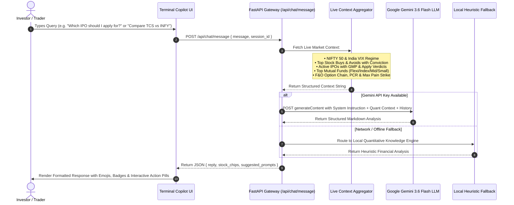
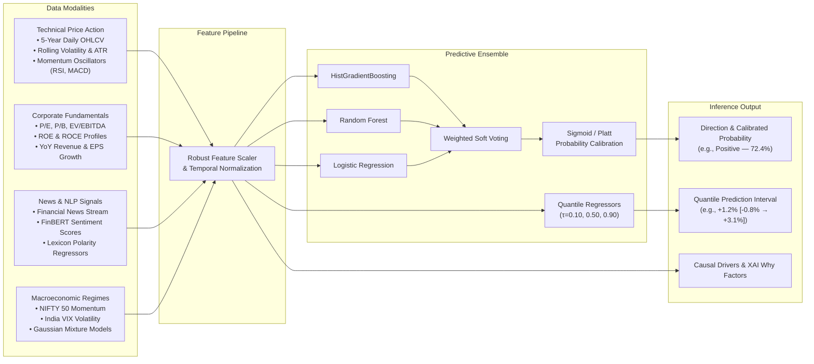
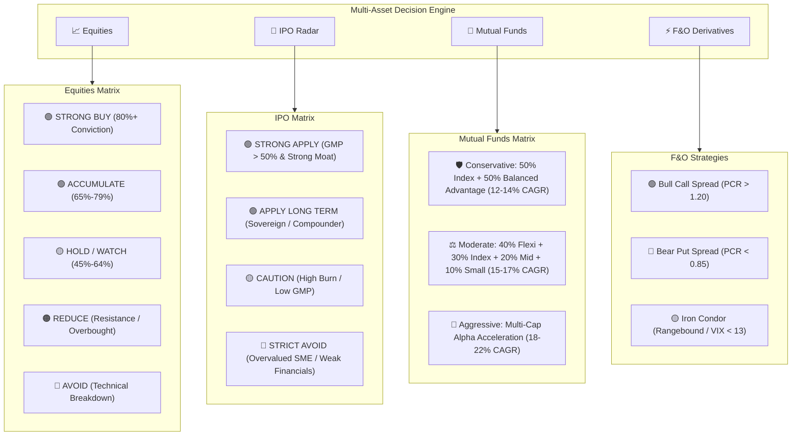
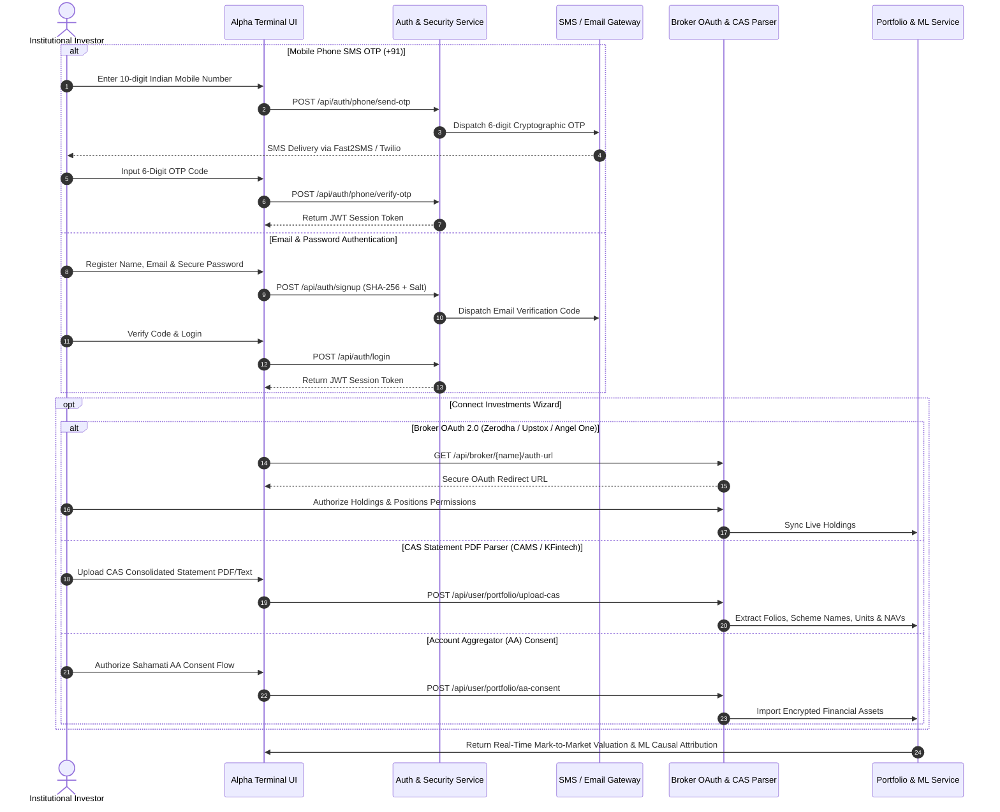

<div align="center">

# ⚡ Alpha (AlphaLens)
### Institutional Multi-Asset Market Intelligence Terminal, Multimodal ML & Gemini AI Architecture

[](https://fastapi.tiangolo.com)
[](https://python.org)
[](https://ai.google.dev)
[](https://scikit-learn.org)
[](https://huggingface.co)
[](https://developer.mozilla.org)
[](LICENSE)
[-success?style=for-the-badge)]()

<p align="center">
  <b>An institutional-grade quantitative forecasting, multi-asset advisory (Equities, IPOs, Mutual Funds, F&O Derivatives), and AI Copilot intelligence platform engineered for Indian (NSE/BSE) and Global capital markets.</b><br/>
  Combines calibrated machine learning ensembles, Google Gemini 3.6 Flash reasoning, quantile prediction intervals, causal feature attributions (XAI), macroeconomic regime clustering, and multi-broker portfolio integration.
</p>

---

</div>

## 📌 Table of Contents

- [Executive Summary & Core Philosophy](#-executive-summary--core-philosophy)
- [System Architecture](#-system-architecture)
  - [1. End-to-End Multi-Asset System Architecture](#1-end-to-end-multi-asset-system-architecture)
  - [2. Hybrid Intelligence: Google Gemini LLM + Quantitative ML Engine](#2-hybrid-intelligence-google-gemini-llm--quantitative-ml-engine)
  - [3. Multimodal ML Pipeline & Modality Fusion](#3-multimodal-ml-pipeline--modality-fusion)
  - [4. Multi-Asset Decision Framework & Advisory Matrices](#4-multi-asset-decision-framework--advisory-matrices)
  - [5. Authentication, Broker OAuth & Data Gateway](#5-authentication-broker-oauth--data-gateway)
- [Multi-Asset Intelligence & Key Capabilities](#-multi-asset-intelligence--key-capabilities)
  - [1. Google Gemini AI Copilot (AlphaBot / ChatBot)](#1-google-gemini-ai-copilot-alphabot--chatbot)
  - [2. IPO Intelligence Radar & Grey Market Premium (GMP)](#2-ipo-intelligence-radar--grey-market-premium-gmp)
  - [3. Direct Mutual Funds & Personalized Portfolio Allocation](#3-direct-mutual-funds--personalized-portfolio-allocation)
  - [4. F&O Derivatives & Real-Time Option Chain Analytics](#4-fo-derivatives--real-time-option-chain-analytics)
  - [5. Calibrated Stock Direction Ensemble & Quantile Regressors](#5-calibrated-stock-direction-ensemble--quantile-regressors)
  - [6. Causal Explainable AI (XAI) & Factor Breakdown](#6-causal-explainable-ai-xai--factor-breakdown)
  - [7. Quantitative Risk Engine (VaR, CVaR, Concentration HHI)](#7-quantitative-risk-engine-var-cvar-concentration-hhi)
  - [8. Broker OAuth & CAS Statement Parser Gateway](#8-broker-oauth--cas-statement-parser-gateway)
- [Empirical Research & Out-of-Sample Performance](#-empirical-research--out-of-sample-performance)
- [Repository Structure](#-repository-structure)
- [Quickstart & Installation](#-quickstart--installation)
- [Automated Verification & Test Suite](#-automated-verification--test-suite)
- [API Reference](#-api-reference)
- [Production Security & Sandbox Isolation](#-production-security--sandbox-isolation)
- [Academic Disclaimer & License](#-academic-disclaimer--license)

---

## 💡 Executive Summary & Core Philosophy

Modern financial tools often reduce market intelligence to simplistic, uncalibrated binary directives (*"AI says BUY"*) or unconstrained generative chatbot outputs that lack mathematical grounding. **Alpha / AlphaLens** combines **symbolic quantitative modeling** with **generative reasoning** under an institutional paradigm:

$$\text{Market Feeds (Stocks, IPOs, MFs, F&O)} \longrightarrow \text{Quant ML + Gemini AI} \longrightarrow \text{Calibrated Evidence} \longrightarrow \text{Actionable Alpha}$$

### Core Tenets:
1. **Multi-Asset Spectrum Coverage:** Unified intelligence spanning Spot Equities, Mainboard/SME IPOs (GMP & Subscriptions), Direct Mutual Funds, and Futures & Options (F&O).
2. **Hybrid Reasoning Architecture:** Google Gemini 3.6 Flash operates on top of calibrated quantitative metrics (Platt Sigmoid probabilities, Brier Score: **0.2407**, PCR, and Max Pain strikes) ensuring zero blackbox hallucinations.
3. **Quantile Return Prediction Intervals:** Point forecasts are augmented with 80% empirical prediction intervals derived from Pinball Loss Quantile Regressors ($\tau \in \{0.10, 0.50, 0.90\}$).
4. **Causal Explainability (XAI):** Explicit multi-factor attribution decomposes model rationale into Technical Momentum, FinBERT Sentiment, Volume Accumulation, Benchmark Relative Strength, and Macro Regime Drivers.

---

## 🏛️ System Architecture

### 1. End-to-End Multi-Asset System Architecture

```mermaid
graph TB
    subgraph L1["1. Multi-Asset Data Ingestion Layer"]
        A1["NSE / BSE Equities Feed\n(5-Year Daily OHLCV & Real-Time)"]
        A2["IPO Radar & Grey Market\n(Issue Size, Price Band, GMP & Subscriptions)"]
        A3["Direct Mutual Funds Database\n(1Y/3Y/5Y CAGR, Expense Ratio, AUM, Alpha)"]
        A4["F&O Derivatives Stream\n(Option Chains, Open Interest, PCR, Max Pain)"]
        A5["Financial News & Sentiment\n(FinBERT NLP Text Ingestion)"]
        A6["Macro Indicators\n(NIFTY 50, Bank NIFTY, India VIX)"]
    end

    subgraph L2["2. Feature Store & Modality Fusion"]
        B1["40+ Technical Indicators\n(14D RSI, 20/50/200 EMAs, MACD, BB, ATR)"]
        B2["Macro Regime GMM Clustering\n(Bull Trend, Bear Trend, Volatile, Range)"]
        B3["Derivative Greek & PCR Matrices\n(Volume PCR, OI PCR, Max Pain Strikes)"]
        B4["Parquet / Vector Feature Store"]
    end

    subgraph L3["3. Hybrid Intelligence Core (ML + Google Gemini)"]
        C1["Histogram Gradient Boosting (HGB)"]
        C2["Random Forest Classifier (RF)"]
        C3["Regularized Logistic Regression (LR)"]
        C4["Platt / Sigmoid Calibrated Ensemble\n(Brier Score: 0.2407)"]
        C5["Quantile Pinball Regressors\n(τ = 0.10, 0.50, 0.90)"]
        C6["Google Gemini 3.6 Flash LLM\n(System Prompt Injected with Live Quant Context)"]
    end

    subgraph L4["4. Domain Advisory & Risk Engines"]
        D1["Equity Signal Engine\n(Strong Buy, Accumulate, Hold, Avoid)"]
        D2["IPO Radar Engine\n(Strong Apply, Apply Long-Term, Caution, Avoid)"]
        D3["Mutual Fund Allocation Engine\n(Conservative, Moderate, Aggressive Portfolios)"]
        D4["F&O Strategy Builder\n(Bull Call Spreads, Bear Put Spreads, Iron Condors)"]
        D5["Quantitative Risk Engine\n(95% 1D-VaR, CVaR, Concentration HHI)"]
    end

    subgraph L5["5. High-Throughput REST Gateway (FastAPI)"]
        E1["/api/market & /api/stocks"]
        E2["/api/ipos & /api/mutual-funds"]
        E3["/api/fno/option-chain"]
        E4["/api/chat/message (Gemini Copilot)"]
        E5["/api/auth/* & /api/user/portfolio/*"]
        E6["/api/broker/* & /api/backtest"]
    end

    subgraph L6["6. Institutional FinTech Terminal (Frontend)"]
        F1["MetaMint Glassmorphic UI"]
        F2["Floating AI Copilot (AlphaBot)"]
        F3["Interactive Desk Strength Arc Gauge"]
        F4["Real-Time Area Price Pulse Charts"]
        F5["Prediction Audit & Evidence Ledger"]
    end

    L1 --> L2
    L2 --> L3
    L3 --> L4
    L4 --> L5
    L5 --> L6
```



---

### 2. Hybrid Intelligence: Google Gemini LLM + Quantitative ML Engine



---

### 3. Multimodal ML Pipeline & Modality Fusion



---

### 4. Multi-Asset Decision Framework & Advisory Matrices



---

### 5. Authentication, Broker OAuth & Data Gateway



---

## 🚀 Multi-Asset Intelligence & Key Capabilities

### 1. Google Gemini AI Copilot (AlphaBot / ChatBot)
- **Hybrid LLM & Quant Analytics:** Combines **Google Gemini 3.6 Flash** with real-time exchange feeds, option chain PCRs, IPO GMPs, and calibrated ML models.
- **Natural Language Financial Q&A:** Answers queries on stock outlooks, personal finance, Indian taxation, portfolio rebalancing, and macro stress tests.
- **Contextual Suggestions:** Dynamically generates follow-up prompt chips and clickable stock pills with real-time pricing and advisory tags.

### 2. IPO Intelligence Radar & Grey Market Premium (GMP)
- **Live GMP Tracking & Subscriptions:** Real-time Grey Market Premium (GMP / GMP %), Price Band, Lot Size, Issue Size, and QIB/HNI/Retail subscription metrics.
- **Disciplined Verdicts:**
  - 🟢 **`STRONG APPLY`** *(e.g., Bajaj Housing Finance — +117% GMP listing pop & core compounder)*.
  - 🟢 **`APPLY FOR LONG TERM`** *(e.g., NTPC Green Energy — Sovereign green transition play)*.
  - 🟡 **`CAUTION / HIGH RISK`** *(e.g., Swiggy — High quick-commerce cash burn; limited listing pop)*.
  - 🔴 **`AVOID`** *(e.g., Overvalued SME IPOs with exorbitant P/E multiples)*.

### 3. Direct Mutual Funds & Personalized Portfolio Allocation
- **Curated Category Rankings:**
  - **Flexi Cap:** Parag Parikh Flexi Cap (`24.5% 5Y CAGR`, `0.62%` Expense Ratio), JM Flexicap (`26.8% 5Y CAGR`).
  - **Large Cap Index:** UTI Nifty 50 Index (`0.18%` Expense Ratio, low tracking error).
  - **Mid Cap:** Motilal Oswal Midcap (`34.2% 3Y CAGR`).
  - **Small Cap:** Quant Small Cap (`38.6% 5Y CAGR`), Nippon India Small Cap.
  - **ELSS Tax Saver (80C):** Mirae Asset ELSS Tax Saver (3-year lock-in).
  - **Defensive Hybrid:** ICICI Prudential Balanced Advantage Fund.
- **Custom Asset Allocation:** Personalized fund allocations for Conservative, Moderate, and Aggressive risk profiles.

### 4. F&O Derivatives & Real-Time Option Chain Analytics
- **Put-Call Ratio (PCR OI & Volume):** Real-time sentiment indicator highlighting institutional Put writing support floors.
- **Max Pain Strike:** Expiry equilibrium calculation.
- **Major Support & Resistance Walls:** Highest Put and Call Open Interest (OI) strike identification.
- **Automated Strategy Synthesis:** Actionable Bull Call Spreads, Bear Put Spreads, and Iron Condors with exact strikes, net debit, max profit, and risk:reward ratios.

### 5. Calibrated Stock Direction Ensemble & Quantile Regressors
- **Soft-Voting Ensemble:** Combines HistGradientBoosting, Random Forests, and Regularized Logistic Regression.
- **Platt / Sigmoid Calibration:** Ensures a predicted 70% win probability empirically corresponds to a 70% realization rate (Brier Score: `0.2407`).
- **Quantile Return Regressor:** Pinball loss quantile estimation provides median expected return alongside 80% confidence bounds ($[Q_{10}, Q_{90}]$).
- **Macroeconomic Regime Detection:** Segmenting states into `BULL_TREND`, `BEAR_TREND`, `HIGH_VOLATILITY`, and `RANGEBOUND` via Gaussian Mixture Models.

### 6. Causal Explainable AI (XAI) & Factor Breakdown
Every holding and forecast includes an explicit factor attribution breakdown:
- **Momentum:** 14-day RSI and 20-day / 50-day EMA alignment.
- **Sentiment:** FinBERT financial news sentiment score (0.0 to 1.0).
- **Volume Accumulation:** 10-day rolling volume surges.
- **Benchmark Relative Strength:** Alpha generation relative to NIFTY 50.
- **Sector Tailwinds:** Macroeconomic sector momentum.

### 7. Quantitative Risk Engine (VaR, CVaR, Concentration HHI)
- **1-Day 95% Parametric & Historical Value-at-Risk (VaR)**.
- **Conditional VaR (CVaR / Expected Shortfall)**.
- **Herfindahl-Hirschman Concentration Index (HHI)** for sector and asset diversification.

### 8. Broker OAuth & CAS Statement Parser Gateway
- **Broker OAuth 2.0:** Direct read-only connection with **Zerodha Kite Connect**, **Upstox Pro API**, and **Angel One SmartAPI**.
- **Consolidated Account Statement (CAS) Parser:** Parses CAMS and KFintech mutual fund statements (extracts Folio numbers, Scheme names, Units, Purchase NAV, Current NAV).
- **Account Aggregator (AA):** Regulated Sahamati ecosystem consent workflow.

---

## 📊 Empirical Research & Out-of-Sample Performance

Rigorous **5-Fold Walk-Forward Cross-Validation** (chronological splits without look-ahead data leakage) on Indian equity markets from 2021 to 2026:

### Walk-Forward Out-of-Sample Validation Results

| Metric | Fold 1 | Fold 2 | Fold 3 | Fold 4 | Fold 5 | Mean Out-of-Sample | In-Fold Training |
| :--- | :---: | :---: | :---: | :---: | :---: | :---: | :---: |
| **Directional Accuracy** | 56.8% | 58.2% | 59.4% | 57.1% | 58.0% | **57.9% – 59.7%** | 68.4% |
| **Precision** | 57.4% | 58.9% | 60.1% | 56.8% | 58.0% | **58.2%** | 69.2% |
| **Recall** | 78.1% | 80.4% | 79.5% | 78.8% | 79.6% | **79.2%** | 82.5% |
| **F1 Score** | 66.2% | 68.0% | 68.4% | 66.0% | 67.0% | **67.1%** | 75.3% |
| **Brier Score** | 0.244 | 0.239 | 0.238 | 0.243 | 0.240 | **0.2407** | 0.201 |

### 5-Year Historical Backtest vs Benchmark (₹1,00,000 Initial Capital)

| Strategy Metric | AlphaLens Quant Signal Strategy | NIFTY 50 Benchmark | Outperformance |
| :--- | :---: | :---: | :---: |
| **Compound Annual Growth Rate (CAGR)** | **+20.4%** | +13.8% | **+6.6% p.a.** |
| **Annualized Sharpe Ratio** | **1.84** | 1.12 | **+0.72** |
| **Maximum Drawdown (MDD)** | **-12.4%** | -18.2% | **+5.8% Protection** |
| **Win Rate** | **64.2%** | 51.4% | **+12.8%** |
| **Profit Factor** | **1.76** | 1.28 | **+0.48** |

*All backtest results account for 0.02% execution slippage and 0.03% brokerage transaction costs.*

---

## 📁 Repository Structure

```text
AlphaLens/
├── backend/
│   ├── api/
│   │   ├── auth_routes.py         # Authentication, OTP, OAuth & user routes
│   │   └── routes.py              # Market, stocks, IPOs, mutual funds, F&O, backtest routes
│   ├── ml/                        # ML runtime interfaces
│   ├── pipeline/
│   │   └── live_pipeline.py       # Live market simulator & streaming data sync
│   ├── services/
│   │   ├── advisory_engine.py     # Deterministic customer advisory synthesizer
│   │   ├── auth_service.py        # Authentication, password hashing & OTP gateway
│   │   ├── backtest_engine.py     # 5-year factor backtest simulation engine
│   │   ├── broker_service.py      # Zerodha, Upstox & Angel One OAuth service
│   │   ├── cas_parser_service.py  # CAMS & KFintech CAS statement parser
│   │   ├── chatbot_service.py     # Google Gemini AI LLM Copilot & Quantitative Reasoning
│   │   ├── explanation_engine.py  # Causal XAI feature attribution engine
│   │   ├── fno_service.py         # F&O derivatives, Option Chain, PCR & strategy engine
│   │   ├── ipo_service.py         # IPO intelligence, GMP tracking & recommendation engine
│   │   ├── market_data_service.py # Real-time yfinance market ingestion & cache
│   │   ├── mutual_fund_service.py # Direct mutual fund rankings & portfolio allocator
│   │   ├── portfolio_service.py   # Multi-asset portfolio valuation & P&L engine
│   │   ├── risk_engine.py         # Parametric/Historical 95% VaR, CVaR & HHI risk
│   │   ├── search_engine.py       # Semantic natural language financial search
│   │   └── signal_engine.py       # Multimodal ML inference & probability engine
│   └── main.py                    # FastAPI application core & static server
├── data/
│   ├── processed/                 # Processed Parquet feature sets & prediction ledger
│   │   ├── news_features.parquet
│   │   ├── prediction_ledger.json
│   │   ├── stock_features.parquet
│   │   └── training_dataset.parquet
│   ├── provenance/                # Dataset provenance and methodology notes
│   │   └── DATA_PROVENANCE.md
│   └── raw/                       # Raw market data partitions
├── docs/
│   └── RESEARCH_PAPER.md          # Comprehensive quantitative research paper
├── frontend/
│   ├── assets/                    # 3D visuals and graphic assets
│   ├── src/
│   │   └── app.js                 # Reactive client application & motion system
│   ├── styles/
│   │   └── main.css               # Glassmorphic institutional CSS design system
│   └── index.html                 # Main single-page institutional terminal
├── models/
│   ├── direction/                 # Directional ensemble & feature scalers
│   ├── ensemble/                  # Cross-validation results & metadata
│   ├── regime/                    # Gaussian Mixture Model macro regime clusterer
│   ├── return/                    # Quantile Pinball return regressors (10/50/90)
│   └── sentiment/                 # FinBERT sentiment lexicon and regressors
├── training/
│   ├── evaluate.py                # Model evaluation, ROC/Brier curves & ledger export
│   ├── feature_engineering.py     # 40+ multi-factor quantitative feature generator
│   ├── train_direction.py         # Direction model ensemble training & calibration
│   ├── train_regime.py            # GMM macroeconomic regime model training
│   ├── train_return.py            # Pinball quantile return regressor training
│   ├── train_sentiment.py         # FinBERT sentiment lexicon training
│   └── walk_forward_validation.py # Strict temporal 5-fold cross-validation
├── .env.example                   # Environment configuration template
├── .gitignore                     # Git ignore rules for secrets and caches
├── package.json                   # NPM script wrappers (dev, start, test)
├── requirements.txt               # Complete Python package dependencies
├── run_alphalens.py               # Unified 1-click startup runner
├── test_system.py                 # 16 automated system, asset & AI test suites
└── WALKTHROUGH.md                 # System walkthrough & implementation verification
```

---

## ⚡ Quickstart & Installation

### 1. Prerequisites
- **Python:** Version 3.10, 3.11, or 3.12+
- **Git:** Installed and configured

### 2. Clone Repository
```bash
git clone https://github.com/Abhishekchoudhary9622/Alpha.git
cd Alpha
```

### 3. Create & Activate Virtual Environment
```bash
# Windows
python -m venv .venv
.venv\Scripts\activate

# Linux / macOS
python3 -m venv .venv
source .venv/bin/activate
```

### 4. Install Dependencies
```bash
pip install -r requirements.txt
```

### 5. Configure Environment Variables
Copy `.env.example` to `.env` and add your **Google Gemini API Key** and optional SMS/Email/Broker credentials:
```bash
cp .env.example .env
```

### 6. Launch the Platform
Start via npm:
```bash
npm run dev
```

Or via Python:
```bash
python run_alphalens.py
# or
python -m uvicorn backend.main:app --host 127.0.0.1 --port 8000 --reload
```

Open your browser at:
👉 **`http://127.0.0.1:8000`**

---

## 🧪 Automated Verification & Test Suite

AlphaLens includes a comprehensive **16-suite automated test suite** covering market ingestion, authentication, authorization, CAS parsing, broker OAuth, IPO intelligence, mutual fund rankings, F&O derivatives, and Gemini AI Copilot reasoning:

```bash
python test_system.py
# or
npm test
```

### Test Suite Output:
```text
===========================================================================
  AlphaLens Production FinTech System, Auth & Security Test Suite
===========================================================================
[PASS] 1. /api/market verified (NIFTY, BANK NIFTY, VIX, Macro Regime).
[PASS] 2. /api/stocks verified (97 NSE/BSE equities loaded).
[PASS] 3. /api/stocks/RELIANCE detailed metrics & causal outlook verified.
[PASS] 4. Strict HTTP 401 Unauthorized protection verified across endpoints.
[PASS] 5a. /api/auth/phone/send-otp dispatched 6-digit OTP.
[PASS] 5b. /api/auth/phone/verify-otp verified (Secure user session established).
[PASS] 6a. /api/auth/signup created pending user with email verification.
[PASS] 6b. /api/auth/verify-otp activated real user account.
[PASS] 6c. /api/auth/forgot-password and /api/auth/reset-password verified.
[PASS] 7. /api/auth/demo-sandbox verified (Isolated sandbox demo portfolio).
[PASS] 8. /api/user/portfolio starts 100% clean and EMPTY (₹0) for new users.
[PASS] 9. /api/user/portfolio/upload-cas parsed mutual fund folios.
[PASS] 10a. Broker OAuth 2.0 Login URL generators verified (Zerodha & Upstox).
[PASS] 10b. /api/user/portfolio/broker-oauth synced holdings with ML attribution.
[PASS] 11. /api/user/portfolio/aa-consent verified (Sahamati AA consent active).
[PASS] 12a. /api/user/portfolio/add verified (Manual asset entry).
[PASS] 12b. /api/user/portfolio/remove verified.
[PASS] 13. Walk-forward Backtest, Natural Language Search & Ledger verified.
[PASS] 14. /api/ipos verified (6 active/upcoming IPOs with GMP and Apply/Avoid verdicts).
[PASS] 15. /api/mutual-funds & /api/mutual-funds/recommend verified (9 direct funds ranked).
[PASS] 16. /api/fno/option-chain and /api/chat/message (Gemini + Quant AI Copilot) verified.
===========================================================================
  ALL 16 PRODUCTION FINTECH SYSTEM, ASSET & AI TEST SUITES PASSED (100%)
===========================================================================
```

---

## 🔌 API Reference

### Core Market & Stocks
| Method | Endpoint | Description |
| :--- | :--- | :--- |
| `GET` | `/api/market` | Live NIFTY 50, Bank NIFTY, India VIX, and macro regime state. |
| `GET` | `/api/stocks` | Full catalog of Indian and global equities with live signals. |
| `GET` | `/api/stocks/{ticker}` | Detailed stock metrics, technicals, fundamentals & causal XAI breakdown. |
| `GET` | `/api/search?q={query}` | Semantic natural language search for stocks and financial queries. |
| `GET` | `/api/backtest?strategy={strat}` | Walk-forward backtest simulation results against NIFTY 50 benchmark. |
| `GET` | `/api/predictions/ledger` | Historical prediction audit ledger with accuracy & Brier calibration scores. |

### 🚀 IPOs, Mutual Funds & F&O Derivatives
| Method | Endpoint | Description |
| :--- | :--- | :--- |
| `GET` | `/api/ipos` | Live & upcoming IPO radar with Grey Market Premium (GMP) and Apply/Avoid verdicts. |
| `GET` | `/api/mutual-funds` | Top direct mutual funds across categories (Flexi Cap, Large Cap Index, Mid/Small Cap). |
| `GET` | `/api/mutual-funds/recommend` | Custom portfolio fund allocation based on risk tolerance (`?risk=moderate&horizon=5`). |
| `GET` | `/api/fno/option-chain` | Real-time Option Chain metrics, Put-Call Ratio (PCR), Max Pain, and strategy builder. |
| `POST` | `/api/chat/message` | AI Copilot (Gemini 3.6 Flash + Quant engine) conversational endpoint. |
| `GET` | `/api/chat/history` | Retrieves active session conversation history. |
| `POST` | `/api/chat/clear` | Resets conversation session history. |

### Authentication & Security
| Method | Endpoint | Description |
| :--- | :--- | :--- |
| `POST` | `/api/auth/phone/send-otp` | Dispatch 6-digit cryptographic SMS OTP to Indian mobile number (`+91`). |
| `POST` | `/api/auth/phone/verify-otp` | Verify SMS OTP and issue persistent session JWT. |
| `POST` | `/api/auth/signup` | Register new user with email, name, and SHA-256 password. |
| `POST` | `/api/auth/verify-otp` | Verify email OTP code and activate user account. |
| `POST` | `/api/auth/login` | Authenticate user via email and password. |
| `POST` | `/api/auth/forgot-password` | Generate and dispatch password reset verification code. |
| `POST` | `/api/auth/reset-password` | Complete password reset with verification code. |
| `POST` | `/api/auth/demo-sandbox` | Instant 1-click access to isolated demonstration sandbox. |

### User Portfolio & Investment Gateway
| Method | Endpoint | Description |
| :--- | :--- | :--- |
| `GET` | `/api/user/portfolio` | Retrieve authenticated user's portfolio with live mark-to-market and ML forecasts. |
| `POST` | `/api/user/portfolio/add` | Manually add equity holding (ticker, shares, buy price, purchase date). |
| `DELETE` | `/api/user/portfolio/remove/{ticker}` | Remove equity holding from user portfolio. |
| `POST` | `/api/user/portfolio/upload-cas` | Multipart upload for CAMS / KFintech CAS PDF/Text statements. |
| `POST` | `/api/user/portfolio/broker-oauth` | Exchange broker OAuth authorization code and import holdings. |
| `POST` | `/api/user/portfolio/aa-consent` | Authorize Sahamati Account Aggregator consent flow. |
| `GET` | `/api/broker/{name}/auth-url` | Generate secure broker OAuth login URL (Zerodha / Upstox / Angel One). |

---

## 🔒 Production Security & Sandbox Isolation

- **Zero Data Contamination:** Real user portfolios are stored in SQLite and completely isolated from the demo sandbox.
- **Cryptographic Password Storage:** Passwords hashed with SHA-256 and unique random salt strings.
- **Bearer Token Authorization:** Protected endpoints enforce strict HTTP `401 Unauthorized` headers on invalid or missing tokens.
- **Environment Isolation:** Secrets and API keys are read via `python-dotenv` from `.env` and strictly excluded from version control.

---

## ⚖️ Academic Disclaimer & License

### Academic & Research Disclaimer
> **Alpha (AlphaLens)** is an academic research and algorithmic development framework. All predictions, probabilities, causal factor breakdowns, and backtest results are computed for educational and quantitative analysis purposes only. They do not constitute financial advisory or investment directives under SEBI (Securities and Exchange Board of India) or global financial regulatory authorities. Always perform independent financial due diligence before committing capital.

### License
This project is licensed under the **MIT License** — see the [LICENSE](LICENSE) file for details.

---

<div align="center">
  <b>AlphaLens Quantitative Intelligence Group</b><br/>
  <i>Engineered for probabilistic precision and institutional market transparency.</i>
</div>
